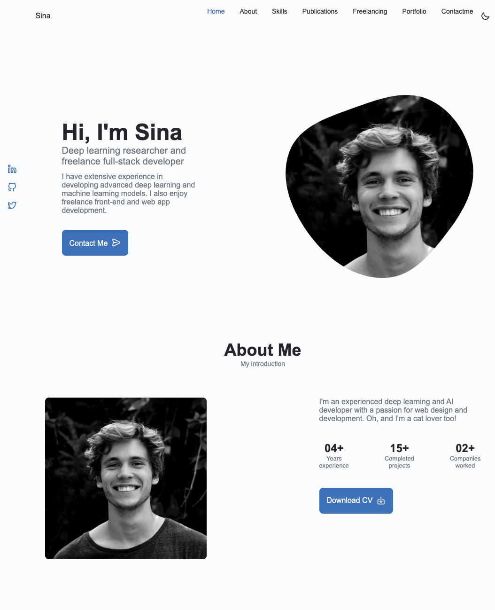
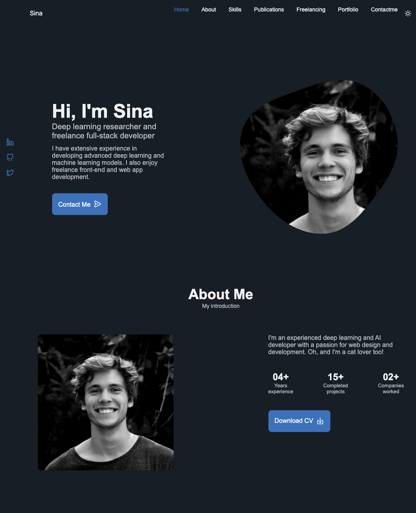

# Responsive Personal Portfoliox - <a href="https://sinatayebati.github.io/responsive-personal-portfolio/">Demo</a>

- This is a minimal theme for building single page personal portfolio websites built with HTML, CSS, JS.
- This website is seamlessly integrated with <a href="https://formspree.io/">Formspree</a>, a Form Submission service enabling users to submit inquiries directly from the website without the hassle of sending emails.

    
    

## Deploying to Github Pages

- Fork or Clone this repo
- Rename the repo to your desired github pages url (E.g yourname.github.io)
- Customize the `index.html` and `assets/css/styles.css` as desired
- Push code to a `gh-pages` branch
- Visit your website at the github pages url you specified in the second step

Learn more about Github pages <a href="https://pages.github.com/">here</a>

## Usage

- Update `assets/css/styles.css` with your desired style
- Update `index.html` with information about yourself
- Inquiry form submission:
    1. Sign up at <a href="https://formspree.io/">Formspree</a>
    2. Under `index.html` navigate to `CONTACT ME` section
    3. Then find the `<form></form>`
    4. change the information under `<form action="provided URL by Formspree" method="POST" class="contact__form grid">` based on the URL provided to you by Formspree.
    5. You are all set!
## License

MIT